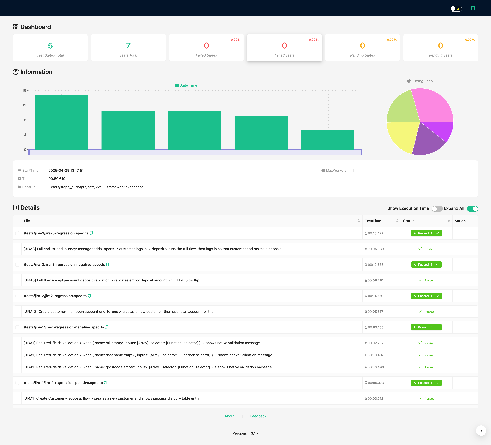

# XYZ Bank E2E Automation Framework

## 1. Introduction

This repository contains an **adapter-driven end-to-end (E2E) testing framework** for the XYZ Bank demo app.  
You write your tests once, and run them against **Playwright**, **Puppeteer**, or **WebdriverIO**—no rewriting required!

Under the hood we use a small core of actions (`open`, `click`, `type`, etc.) wired to whichever engine you choose via the `TEST_ENGINE` environment variable. On top of that sit Page-Object classes for all your flows (Home, Manager, Customer, Deposit, etc.), and a suite of Jest specs covering all the JIRA stories:

- **JIRA-1**: Create Customer  
- **JIRA-2**: Open Account  
- **JIRA-3**: Deposit Funds  

---

## 2. Prerequisites

- **Node.js** v16+  
- **npm** v8+ (or Yarn)  
- A valid **Internet connection** (to load the public demo app)  
- Create a `.env` file at the project root containing:
  ```ini
  BASE_URL=https://www.globalsqa.com/angularJs-protractor/BankingProject
  ```

---

## 3. Getting Started

1. **Clone** this repo:
   ```bash
   git clone https://github.com/YourOrg/xyz-ui-framework-typescript.git
   cd xyz-ui-framework-typescript
   ```
2. **Install** dependencies:
   ```bash
   npm install
   ```
3. **Create** your `.env` (see Prerequisites above).

---

## 4. How to Run the JIRA Tests in Order

Our specs live under `tests/jira-1`, `tests/jira-2`, `tests/jira-3`. To execute them **in order**, serially:

```bash
npm run test:jiras
```

This script runs:
```jsonc
"test:jiras": "jest --runInBand --testPathPattern="tests/jira-(1|2|3)""
```
so JIRA-1 runs before JIRA-2, then JIRA-3.

---

## 5. How to View the Test Report

### 5.1 Console Output

```bash
npm run test:jiras
```

### 5.2 HTML Test Report



1. Install the HTML reporter (once):
   ```bash
   npm install --save-dev jest-html-reporters
   ```
2. Ensure your **`jest.config.js`** includes:
   ```js
   reporters: [
     'default',
     ['jest-html-reporters', {
       publicPath: './html-report',
       filename: 'report.html',
       expand: true
     }]
   ]
   ```
3. Run the JIRAs:
   ```bash
   npm run test:jiras
   ```
4. Open the report:
   - macOS: `open html-report/report.html`  
   - Linux:  `xdg-open html-report/report.html`  
   - Windows: `start html-report\report.html`  


Then open:
```bash
open coverage/lcov-report/index.html
```

---

## 6. Change & Run Different Frameworks

By default `npm test` uses whatever `TEST_ENGINE` you set:

```bash
npm run test:playwright
npm run test:puppeteer
npm run test:webdriverio
```

These scripts set `TEST_ENGINE` for you. Under the hood, our factory spins up the right adapter.

---

## 7. Change Browser

In your adapter (e.g. `src/adapters/playwright.ts`):

```ts
chromium.launch({
  headless: false,    // or true
  slowMo:   100       // slow down each action
});
```

For Puppeteer and WebdriverIO, similar options exist in their launch/config files.

---

## 8. Headless Mode

To run headless, edit the adapter’s launch:

```ts
const headless = process.env.HEADLESS !== 'false';
await chromium.launch({ headless });
```

Then:
```bash
cross-env TEST_ENGINE=playwright HEADLESS=true npm test
```

---

## 9. Test Scenarios Covered

1. **JIRA-1**  
   - Empty fields → HTML5 tooltip  
   - Successful customer creation alert + table entry  
   - Duplicate-customer warning  

2. **JIRA-2**  
   - Open a new account → success alert + table update  

3. **JIRA-3**  
   - Empty deposit → HTML5 validation  
   - Deposit success → banner + balance update + transaction row  

4. **Smoke Tests**  
   - Home → Customer Login → dashboard  
   - Manager Login → Add Customer → Open Account  

5. **End-to-End Flows** across manager & customer roles.

---

## 10. Final Thoughts

This adapter-driven framework gives you:

- **One & done** tests across multiple UI engines  
- **Clean Page-Object layers** for maintainability  
- **Jest** for consistency, powerful assertions & reporting  
- **Easy switching** between Playwright, Puppeteer, WebdriverIO  

Feel free to extend with screenshot-on-fail, CI/CD hooks (GitLab/Jenkins), or add Cypress support. Happy testing! 🚀
